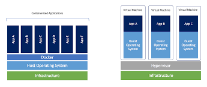

# Docker Workshop

#### Hur hamnade vi här?

Förr i tiden kunde vi endast köra en applikation per server, så varje gång ett företag behövde en ny applikation krävdes en ny server. Eftersom att en applikation som ligger nere är en väldigt dålig applikation, så betydde det att man ofta köpte in stora servrar och fick som konsekvens ett väldigt dåligt utnyttjande av resurser då applikationerna allt som oftast inte alls behövde så mycket resurser.

In kom **Virtual Machines**. Om detta är ett nytt koncept för dig kan du tänka på det engelska uttrycket "virtually the same". 

En "real" Machine, en dator, har hårdvara så som CPU, RAM och storage. På detta har vi ett operativsystem, som kontrollerar hur applikationer använder datorns hårdvara. Då har vi alltså applikationerna körandes på operativsystemet. 

Men vad händer om vi har en dator med Mac OS och vill installera Linux? Ett alternativ hade varit att köpa oss en ny dator och installera Linux. Då har vi ju de operativsystem vi vill använda.

Men **Name of The Game** här är att **använda våra resurser effektivt**. Skulle det inte ha varit härligt om vi skulle kunna dela upp hårdvaru-resurser på vår första dator och ha både Mac OS och Linux installerat på den? Om du svarade ja på den frågan har jag goda nyheter. Genom användandet av en **hypervisor** är detta möjligt.

Hypervisor är en teknologi som vars stora syfte här i livet är att hantera olika VMs på en och samma *host*. Det finns två olika typer av hypervisors **type 1** och **type 2**.

Type 1 körs direkt på *host machines* underliggande hårdvara.

Type 2 installeras på ett existerande operativsystem.

Om vi utgår ifrån type 2, även kallad **hosted hypervisor** så installeras detta på operativsystem, som ber host os, det operativsystem den är installerad på, att allokera resurser från hårdvaran till en ny VM. En VM är helt isolerad från host machine. Ingenting som händer i den virtuella miljön kan påverka någonting utanför.

Så vad betyder detta för oss? Vi började med att säga att förr om åren så krävdes en server per applikation, men nu har vi alltså möjlighet att dela upp servern i olika delar, vilket ju måste vara kanon för vad vi sa är name of the game: använda våra resurser effektivt.

Nja.

Det finns vissa nackdelar med VMs. För det första kräver dem sitt egna operativsystem. Varje OS konsumerar resurser, vilka skulle kunna användas till att köra fler applikationer.

Bilden till höger representerar hur VMs funkar.

Och nu nu till vår slutdestination: Containerteknologi.

En container är en liten behållare som innehåller allt vi behöver för att köra vår applikation. En container går att likna vid en VM, med den stora skillnaden att den inte behöver sitt egna dedikerade operativsystem.

Docker är en plattform som skapades för att hantera och köra containers. Även om containers var en teknologi som fanns även innan Docker så har landskapet till stor del förändrats efter dess intåg. Vad man gjorde var att skapa tjänster kring containers som gjorde det väldigt simpelt för oss dödliga att använda.

###### Moderna applikationer

Vi kommer här att komma in på **microservices**, vilket är ett koncept som ligger till grund för många moderna applikationer idag. Men låt oss börja med **förr om åren**.

Förr om åren använde man sig av en **monolith architecture**. Vad som definierar en **monolith** är att samtliga komponenter i en applikationen körs på ett enskillt program. En stor klump helt enkelt.

Dessa applikationer är svåra att göra ändringar på, väldigt svåra att felsöka i och att använda sig av en CI/CD-kedja vore väldigt, väldigt segt, då varje liten förändring krävde att hela applikation *recompiled*.

Vidare började vi utveckla applikationer efter ett **three-tier architecture** baserat på presentation, applikation och data. Nu kunde olika typer av utvecklare fokusera på sina egna delar. Varje del kan köras på olika host, men delarna kommunicerade endast inne i samma applikation.

Nu till vår slutdestination: **microservices**.

Det är yterliggare ett steg i att *decouple* vår applikations komponenter till mindre delar. Man kan definera en enskild microservice som en bit **business functionality** som kan utvecklas och deployas för sig självt. En applikation blir således uppbyggs av många microservices.

En modern applikation brukar inneha följande egenskaper:

- Komponenter baserade på microservices
- En komponents *state* kommer att hanteras externt
- Den ska kunna köras överallt
- Redo för komponent-uppdateringar
- Varje komponent körs enskilt, men kan användas av andra komponenter

En container lämpas sig väldigt bra för en microservice, och det är poängen jag ville komma till här.

#### Containerteknologi

En container kan defineras som en process som som innehåller all kod och dependencies som krävs för att köra en applikation.

En process är ett sätt för oss att interagera med underliggande OS. Den använder sig av systemresurser men körs ändå isolerat. Varje process som körs hanteras av kernel. Kernels syfte här i livet är att ansvara för processerna; ge dem tillräckligt med resurser och se till så att de körs isolerat.

Men låt oss ta det i rätt ordning. Varifrån kommer containers? En container baseras på en image och man brukar säga att en container en **runtime instance of an image**.

###### Images

Vi har alltid en mall för våra containers. Denna mall kallas för **Image**. Den innehåller allt som vi vill att våra container ska innehålla och hur den ska bete sig.

Varje gång vi använder oss av en(samma) Image kommer den att generera samma resultat.

Docker Images byggs upp av lager, och dessa lager tillsammans kommer att innehålla allt som krävs för att köra Containern. Varje lager är *read only* och förändringar i ett lager lagras i nästkommande lager. På så vis kommer varje lager endast ha mindre förändringar från tidigare steg.

###### Containers

En Docker Container skapas alltså utifrån en mall, Docker Image och är i stort sätt en process.

Kubernetes:
https://github.com/AlexisFlach/Kubernetes-study

> Docker is a set of platform as a service products that use OS-level virtualization to deliver software in packages called containers.

**Hämtat från https://en.wikipedia.org/wiki/Docker_(software) **

Baserat på detta påstående kan vi plocka ut tre punkter:

- Docker är en plattform till för använda containers
- För att uppnå detta använder man sig av OS-level virtualization
- Containers är paketerat software(applikationer)

